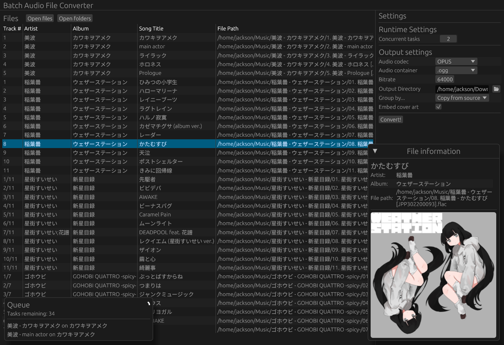

# Batch Audio File Converter
A small program built on top of [FFmpeg](https://ffmpeg.org/), to mass transcode audio files from one format to another, while preserving metadata and cover art.

## Features
- Support for many codecs:
    - FLAC
    - MP3
    - AAC
    - OPUS
    - VORBIS
- Multi-threaded transcode (thanks to FFmpeg)
- Metadata viewing

> This software uses libraries from the FFmpeg project under the LGPLv2.1
> FFmpeg is dynamically linked. You can replace the FFmpeg shared libraries with your own build if desired.
> A copy of the LGPL 2.1+ license is included in this project.
